# Hand tracking with DepthAI

Running Google Mediapipe Hand Tracking models on [Luxonis DepthAI](https://docs.luxonis.com/projects/hardware/en/latest/) hardware (OAK-D, OAK-D lite, OAK-1,...)

<p align="center"></p>


- [Hand tracking with DepthAI](#hand-tracking-with-depthai)
  - [What's new ?](#whats-new-)
  - [Introduction](#introduction)
  - [Solo mode vs Duo mode](#solo-mode-vs-duo-mode)
  - [Host mode vs Edge mode](#host-mode-vs-edge-mode)
  - [Body Pre Focusing](#body-pre-focusing)
  - [Frames per second (FPS)](#frames-per-second-fps)
  - [Install](#install)
  - [Run](#run)
  - [Mediapipe models](#mediapipe-models)
  - [Custom model](#custom-model)
  - [Code](#code)
  - [Landmarks](#landmarks)
  - [Examples](#examples)
  - [Credits](#credits)

## What's new ?
* 18/12/2021:
  * **World landmarks:** the latest versions of the landmark models have a 2nd output that yields estimated real-world 3D coordinates in meters with the origin at the hand’s approximate geometric center. Note that this brings very similar information to the "classic" output that yields also 3D coordinates but in a normalized form. To use the world landmarks, set the HandTracker's argument *use_world_landmarks* to True. It will fill the HandRegion's attribute *world_landmarks*. The example [Pseudo-3D visualization with Open3d + smoothing filtering](examples/3d_visualization) has been updated to demonstrate the differences between the various kinds of landmarks.  
* 24/11/2021:
  * **Duo mode speed improvement:** the bug in depthai that prevented to use two threads for the landmark model has been solved. So now the default number of threads in Duo mode for this model is 2 (still can be manually set to 1 with the 'lm_nb_threads' argument), and 1 in Solo mode.
  
    *Note: in Duo mode, when 2 hands are actually present in the image, the skeleton of one of the two hands may appear shifted relatively to the hand in the image, as if there were a delay for this hand. For some applications (e.g. gesture recognition), this is not a problem. For others, you may want to limit the shifting.  You can do it at the cost of slower speed by using the '--dont_force_same_image' flag of the demo\*.py scripts or set 'use_same_image=False' when creating the HandTracker instance in your code.*
* 01/11/2021: 
  * **Add sparse version of Mediapipe Landmark models:** the tflite sparse version was released by Google Mediapipe on 18/10/2021, with the full and lite versions, but until now it hadn't been successfully converted into a blob file. This has changed thanks to the effort of [Pinto](https://github.com/PINTO0309). After conversion, we lose the advantage of a smaller model size (the sparse tflite model is 60% smaller than the full tflite model, whereas the sparse blob is only 2% smaller than the full blob). But the sparse blob model is around 10% faster than the full one (that's what made me include the sparse version in this repository). So in practice, now, we have the option `sparse`, in addition to `full` and `lite` for the `lm_model` argument.
* 24/10/2021:
  * **Duo mode** replaces Multimode: Duo mode means "fast 2 hands tracking" (fast because calculated ROIs from landmarks of the previous frame are used whenever possible). With older Multimode, there was no limit on the number of hands but no smart tracking either, the slow palm detection was called on every frame. Solo mode is still available and is still the preferred mode if your application does not need 2 hands detection.
  
    ~~*Note: currently, a bug that corrupts the output of the landmark model when using 2 threads prevents us to run the Duo mode at optimal speed. Until a solution is found by Luxonis and Intel, please keep `lm_nb_threads` to 1.*~~ 
  * **Robust handedness:** when using Body Pre Focusing, the handedness is given by the wrist keypoint from the body detection (handedness inferred by the landmark model is used only if body information is not reliable). When not using Body Pre Focusing, the handedness is the average of the previous inferred handednesses since the hand is tracked, which brings robustness (this is the recommended behaviour but the user has still the option to use only the last inferred handedness as before via the `use_handedness_average` flag). 
  *  **Two versions of code (with and without Body Pre Focusing):** because the implementation of Body Pre Focusing made the code lenghtier and more complex, I decided to make 2 versions of the scripts and of the classes. This way, it should be easier for users that don't need BPF to appropriate and adapt the code to their own need. So now, we have: demo.py vs demo_bpf.py, class HandTracker vs class HandTrackerBpf, HandTrackerEdge vs HandTrackerBpfEdge, and so on.
  *  **New Mediapipe Landmark models (released 18/10/2021):** there are now 2 versions of the hand landmark model: `full` and `lite`. `full` is more accurate but slower then `lite`. The older version (mediapipe tag 0.8.0, 04/12/2020) is a bit faster than the new `lite` version, is still available in the models directory (hand_landmark_080_sh4.blob).


## Introduction

You must know a few concepts before choosing which options best fit your application. Some of the concepts introduced here are more detailled in the following sections.

Hand Tracking from Mediapipe is a 2-stages pipeline. First, the Hand detection stage detects where are the hands in the whole image. For each detected hand, a Region of Interest (ROI) around the hand is calculated and fed to the second stage, which infers the landmarks. If the confidence in the landmarks is high enough (score above a threshold), the landmarks can be used to directly determined the ROI for the next frame (without the need to use the first stage). This means that the global speed and the FPS can vary and directly depend on the maximal number of hands we **want** to detect (Solo vs Duo modes) and the actual number of hands in the image. For instance, tracking one hand in Solo mode is faster than tracking one hand in Duo mode.
<p align="center">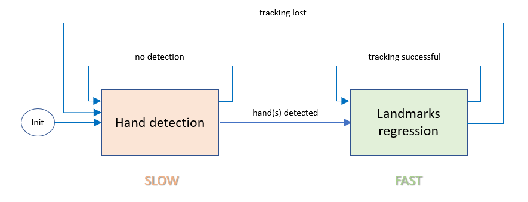</p>


We can roughly consider 2 types of application, depending on the user's position relative to the camera:
  1) The user is close to the camera (< 1.5 m), typically the user and the camera are at fixed positions (for instance, the user sits behind a desk, the camera pointing to him). Here the tracker does a good job at tracking the hands even if they are moving relatively fast. In the example below, hand poses are used to emulate key strokes;
<p align="center"></p>

  2) The user can stand at any position in the room, so the distance user-camera can vary a lot (let's say between 1m and 5m). A good example of such application is the use of hand poses for remote controlling connected devices. In the example below, the user switches on/off a light by closing his hand, he is seated in an armchair, but we want the app to work also if he stands near the door 2 meters behind. Because the Mediapipe Hand detection model was not designed to deal with long distance,  we use a mechanism called [Body Pre Focusing](#body-pre-focusing) to help locate the hands. It is important to note that the further the distance, the more difficult the tracking is, because fast move appear fuzzier on the image. So for this type of application, it is highly recommended that once the hand pose is taken, the arm keeps still during the pose.

<p align="center"></p>


## Solo mode vs Duo mode

* In **Solo mode**, one hand max is detected. The hand detection model is run only on the first frame or when no hand has been detected in the previous frame. If one or more hands are detected, the landmark model then runs on the ROI associated to the hand palm with the highest score. From the landmarks, the ROI in the next frame is computed based on the assumption that the hand does not move a lot between two consecutive frames, which in practice is a very good bet. 
* In **Duo mode**, we detect only 2 hands max (one right hand, one left hand). In case 2 hands with the same handedness are detected (e.g. 2 left hands, the model may be wrong :-), only one hand is kept. Having 2 hands in every frame in Duo mode is a kind of optimal functionning and we can apply the same mechanism as in Solo mode: each hand is tracked independently, its own ROI in the next frame is computed from its current landmarks, so that there is no need to call the palm detection on the next frame. 
  
    **What happens if the user shows only one hand in Duo mode ?** Well in that case, we need to check in the following frames if a second hand will appear/reappear, and to do that we have to call the hand detection, which is a slow operation. If hand detection is run on every frame (until a second hand appear), the FPS drop is significant. So we introduced a user settable parameter `single_hand_tolerance_thresh` to specify the number of frames during which only one hand is detected before hand detection is run again. This parameter is very application-dependent: for an app where 2 hands are expected most of the time, set `single_hand_tolerance_thresh` to a low value, potentially 0. On the contrary, for an app where most of the time, only one hand is used, and a second hand is needed occasionaly, set `single_hand_tolerance_thresh` to a value between 10 and 30. If the value is too high, the delay between the appearance of the second hand and its actual detection may feels too long to be comfortable. Of course, if you never need a second hand, choose the Solo mode !
    

## Host mode vs Edge mode
Two modes are available:
- **Host mode :** aside the neural networks that run on the device, almost all the processing apart from neural networks is run on the host (the only processing done on the device is the letterboxing operation before the pose detection network when using the device camera as video source). **Use this mode when the image comes from an external input source (video file, image file, host webcam).** Also, it is a minor detail but the rendering of some information (e.g. the body skeleton when using Body Pre Focusing is used) is only possible in Host mode.
- **Edge mode :** most of the processing (neural networks, post-processings, image manipulations) is run on the device thanks to the depthai scripting node feature. It works only with the device camera but is **definitely the best and faster option when working with the internal camera**. Apart from the video frame, the data exchanged between the host and the device is minimal: landmarks of the detected hand (~2kB/frame for 2 hands), and optionally the device video frame. 

## Body Pre Focusing 
**Body Pre Focusing is an optional mechanism meant to help the hand detection when the person is far from the camera.**

<p align="center"></p>

*In the video above, the person is at 5m from the camera. The big yellow square represents the smart cropping zone of the body pose estimator (Movenet). The small green square that appears briefly, represents the focus zone on which the palm detector is run. In this example, hands_up_only=True, so this green square appears only when the hand is raised. Once a hand is detected, only the landmark model runs, as long as it can track the hand (the small yellow rotated square is drawn around the hand)*

The palm detector model from Google Mediapipe was trained to detect hands that are less than 2 meters away from the camera. So if the person stands further away, his hands may not be detected. And the padding used to make the image square before feeding the network contributes even more to the problem. To improve the detection, a body pose estimator can help to focus on a zone of the image that contains only the hands. So instead of the whole image, we feed the palm detector with the cropped image of the zone around the hands.

A possible and natural body pose estimator is Blazepose as it is the model used in the Mediapipe Holistic solution, but here, we chose [Movenet Single pose](https://github.com/geaxgx/depthai_movenet/tree/main/examples/hand_focusing) because of its simpler architecture (Blazepose would imply a more complex pipeline with 2 more neural networks running on the MyriadX).

Movenet gives the wrist keypoints, which are used as the center of the zones we are looking for. Several options are available, selected by the **body_pre_focusing** parameter (illustrated in the table below). 

By setting the **hands_up_only** option, we ask to take into consideration only the hands for which the wrist keypoint is above the elbow keypoint, meaning in practice that the hands are raised. Indeed, when we want to recognize hand gestures, the arm is generally folded and the hand up.


**Recommendations:**
* Use Body Pre Focusing when the person can be at more than 1.5 meter from the camera. When you know that the person always stays at a closer distance, palm detection on the whole image works well enough and Body Pre Focusing would just add an unnecessary overload in the processing. However, note that once a hand has been successfully detected, the body pose network, like the palm detection network, stays inactive on the following frames, as long as the hand landmark regressor can keep track of the hand.
* In the typical use case of gesture recognition, the person raises his hand to make the pose. You probably want to set **hands_up_only** to True, as it is a convenient way to avoid false positive recognition when the hand is not raised. In addition, in Solo mode, **body_pre_focusing=higher** allows to focus on the hand that is higher. In Duo mode, **body_pre_focusing=group** is forced. Another benefit of Body Pre Focusing is that most of the time (see remark below), handedness can be determined directly from the body keypoint, which is much more reliable than the handedness inferred by the landmark model, especially when the body is far from the camera.
* When the person is far, **good image definition and ambient lighting have a big impact on the quality of the detection**. Using a higher resolution (`--resolution ultra`) may help.

**Remarks:**
* There is a small chance that the handedness is incorrect in Solo mode if the focus zone given by the Body Pre Focusing algorithm contains several hands, which happens when hands are close to each other. In that case, the hand with the higher score is selected.
* When **hands_up_only** is used, it means that on the first frame where the hand is detected, the hand is raised. Then, on the following frames, the hand is tracked by the landmark model, and since its position relative to the elbow is not checked anymore, the hand can be lowered without interrupting the tracking.  

|Arguments|Palm detection input |Hand tracker output|Remarks|
|:-:|:-:|:-:|-|
|*No BPF*|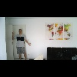|[](img/output_no_bpf.jpg)|Because of the padding, hands get very small and palm detection gives a poor result (right hand not detected, left hand detection inaccurate)|
|*No BPF*<br>crop=True|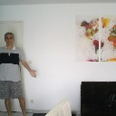|[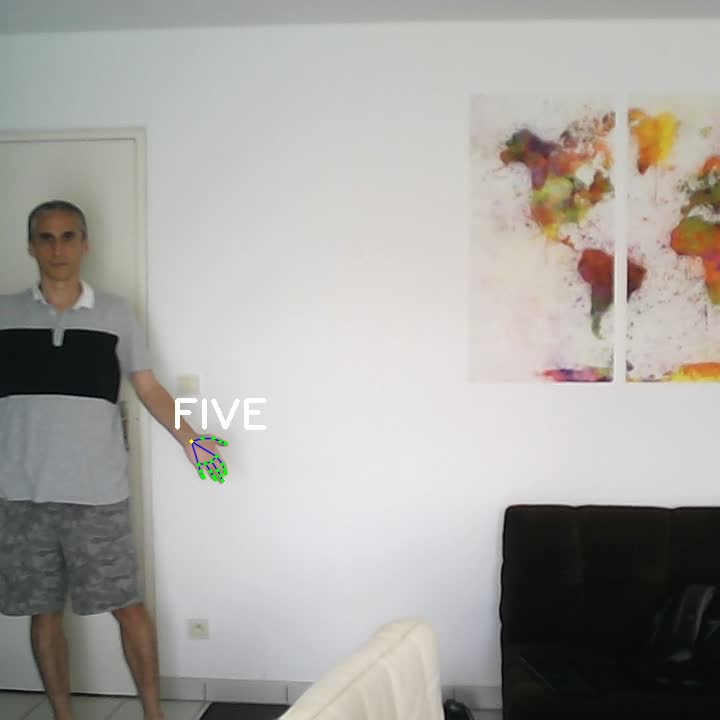](img/output_no_bpf_crop.jpg)|Cropping the image along the shortest side is an easy and inexpensive way to improve the detection, but at the condition the person stays in the center of the image|
|body_pre_focusing=group<br>hands_up_only=False|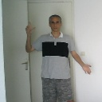|[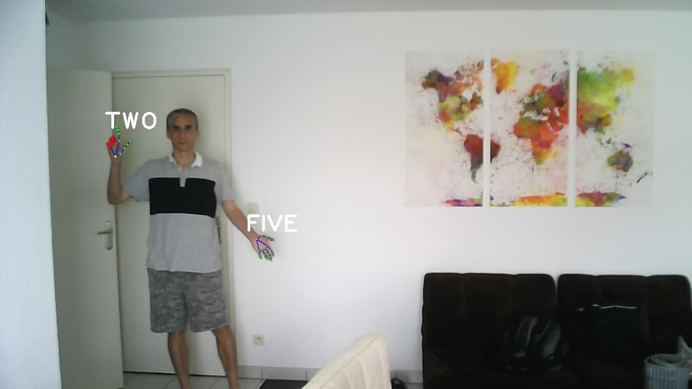](img/output_bpf_group_all_hands.jpg)|BPF algorithm finds a zone that contains both hands, which are correctly detected|
|body_pre_focusing=group<br>hands_up_only=True||[](img/output_bpf_group.jpg)|With "hands_up_only" set to True, the left hand is not taken into consideration since the wrist keypoint is below the elbow keypoint|
|body_pre_focusing=right||[](img/output_bpf_group.jpg)|The right hand is correctly detected, whatever the value of "hands_up_only"|
|body_pre_focusing=left<br>hands_up_only=False|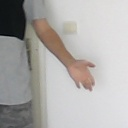|[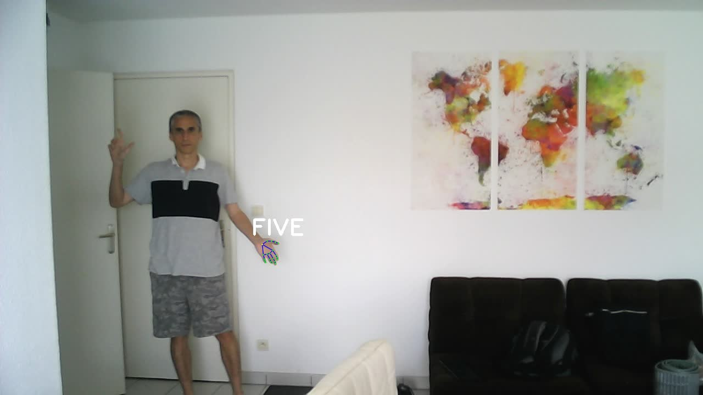](img/output_bpf_left_all_hands.jpg)|The left hand is correctly detected|
|body_pre_focusing=left<br>hands_up_only=true||[](img/output_bpf_left.jpg)|Because the left hand is not raised, it is not taken into consideration, so we fall back to the case where BPF is not used|
|body_pre_focusing=higher||[](img/output_bpf_higher.jpg)|Here, same result as for "body_pre_focusing=right",  whatever the value of "hands_up_only"|

## Frames per second (FPS)

You will quickly notice that **the FPS can vary a lot**.
Of course, it depends on the modes chosen:
- Edge mode is faster than Host mode, 
- Solo mode is faster than Duo mode, 
- Body Pre Focusing introduces a delay in the palm detection, but once a hand is detected you get the same speed as without BPF.

Also the FPS highly depends on the number of hands currently in the image. It may sound counter-intuitive but **the FPS is significantly faster when a hand is present than when not**. Why is that ? Because the palm detection inference is slower than the landmark regression inference. When no hand is visible, the palm detection (or the body detection when using Body Pre Focusing) is run on every frame until a hand is found. Once the hand is detected, only the landmark model runs on the following frame until the landmark model loses the hand's track. Actually, on the best case scenario, the palm detection is run only once: on the first frame !

Important recommendation: **tune the internal FPS !** By default, the internal camera FPS is set to a value that depends on chosen modes and on the use of depth ("-xyz"). These default values are based on my own observations.
When starting the demo, you will see a line like below:
```
Internal camera FPS set to: 36
```
 Please, don't hesitate to play with the parameter `internal_fps` (via `--internal_fps` argument in the demos) to find the optimal value for your use case. If the observed FPS is well below the default value, you should lower the FPS with this parameter until the set FPS is just above the observed FPS.

## Install

Install the python packages (depthai, opencv) with the following command:

```
python3 -m pip install -r requirements.txt
```

## Run

**Usage:**

Use `demo.py` or `demo_bpf.py` depending on whether or not you nedd Bpdy Pre Focusing. `demo_bpf.py` has the same arguments as `demo.py` with 2 more, which are related to BPF: `--body_pre_focusing` and `--all_hands`.
```
->./demo_bpf.py -h
usage: demo_bpf.py [-h] [-e] [-i INPUT] [--pd_model PD_MODEL] [--no_lm]
                   [--lm_model LM_MODEL] [--use_world_landmarks] [-s] [-xyz]
                   [-g] [-c] [-f INTERNAL_FPS] [-r {full,ultra}]
                   [--internal_frame_height INTERNAL_FRAME_HEIGHT]
                   [-bpf {right,left,group,higher}] [-ah]
                   [--single_hand_tolerance_thresh SINGLE_HAND_TOLERANCE_THRESH]
                   [--dont_force_same_image] [-lmt {1,2}] [-t [TRACE]]
                   [-o OUTPUT]

optional arguments:
  -h, --help            show this help message and exit
  -e, --edge            Use Edge mode (postprocessing runs on the device)

Tracker arguments:
  -i INPUT, --input INPUT
                        Path to video or image file to use as input (if not
                        specified, use OAK color camera)
  --pd_model PD_MODEL   Path to a blob file for palm detection model
  --no_lm               Only the palm detection model is run (no hand landmark
                        model)
  --lm_model LM_MODEL   Landmark model 'full', 'lite', 'sparse' or path to a
                        blob file
  --use_world_landmarks
                        Fetch landmark 3D coordinates in meter
  -s, --solo            Solo mode: detect one hand max. If not used, detect 2
                        hands max (Duo mode)
  -xyz, --xyz           Enable spatial location measure of palm centers
  -g, --gesture         Enable gesture recognition
  -c, --crop            Center crop frames to a square shape
  -f INTERNAL_FPS, --internal_fps INTERNAL_FPS
                        Fps of internal color camera. Too high value lower NN
                        fps (default= depends on the model)
  -r {full,ultra}, --resolution {full,ultra}
                        Sensor resolution: 'full' (1920x1080) or 'ultra'
                        (3840x2160) (default=full)
  --internal_frame_height INTERNAL_FRAME_HEIGHT
                        Internal color camera frame height in pixels
  -bpf {right,left,group,higher}, --body_pre_focusing {right,left,group,higher}
                        Enable Body Pre Focusing
  -ah, --all_hands      In Body Pre Focusing mode, consider all hands (not
                        only the hands up)
  --single_hand_tolerance_thresh SINGLE_HAND_TOLERANCE_THRESH
                        (Duo mode only) Number of frames after only one hand
                        is detected before calling palm detection (default=10)
  --dont_force_same_image
                        (Edge Duo mode only) Don't force the use the same
                        image when inferring the landmarks of the 2 hands
                        (slower but skeleton less shifted)
  -lmt {1,2}, --lm_nb_threads {1,2}
                        Number of the landmark model inference threads
                        (default=2)
  -t [TRACE], --trace [TRACE]
                        Print some debug infos. The type of info depends on
                        the optional argument.

Renderer arguments:
  -o OUTPUT, --output OUTPUT
                        Path to output video file
```

**Some examples:**

Whenever you see `demo.py`, you can replace by `demo_bpf.py`.

- To use the color camera as input in Host mode (by default, the `lite` version of the landmark model is used):

    ```./demo.py``` 

- Same as above but with the `full` version of the landmark model:

    ```./demo.py --lm_model full``` 
    
    or with the older but faster version 0.8.0:

    ```./demo.py --lm_model models/hand_landmark_080_sh4.blob```

- To use the color camera as input in Edge mode (recommended for Solo mode):

    ```./demo.py -e```

- To use the color camera as input in Edge mode when you don't need to retrieve the video frame (only the landmark information is transfered to the host):

    ```./demo.py -e -i rgb_laconic```

- To use a file (video or image) as input (Host mode only):

    ```./demo.py -i filename```

- To enable gesture recognition:

    ```./demo.py [-e] -g```

  

- Recommended options for gesture recognition when the person can move a few meters from the camera:

    ```./demo_bpf.py -e -g -bpf higher```

    or

    ```./demo_bpf.py -e -g -bpf higher --resolution ultra```   (a bit slower but better image definition)

- To measure hand spatial location in camera coordinate system (only for depth-capable device like OAK-D):

    ```./demo.py [-e] -xyz```

    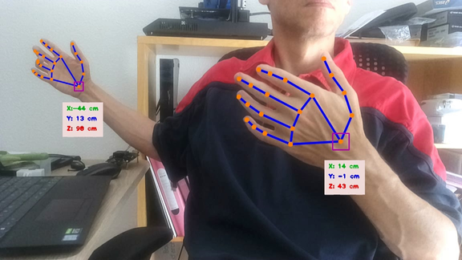

    The measure is made on the wrist keypoint (or on the palm box center if '--no_lm' is used).

- To run only the palm detection model (without hand landmarks, Host mode only):

    ```./demo.py --no_lm```

    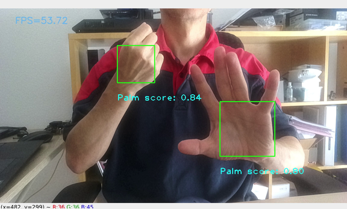

    Of course, gesture recognition is not possible in this mode.


|Keypress|Function|
|-|-|
|*Esc*|Exit|
|*space*|Pause|
|1|Show/hide the palm bounding box (only in non solo mode)|
|2|Show/hide the palm detection keypoints (only in non solo mode)|
|3|Show/hide the rotated bounding box around the hand|
|4|Show/hide landmarks|
|5|Show/hide handedness (several display mode are available)|
|6|Show/hide scores|
|7|Show/hide recognized gestures (-g or --gesture)|
|8|Show/hide hand spatial location (-xyz)|
|9|Show/hide the zone used to measure the spatial location (-xyz)|
|f|Show/hide FPS|
|b|Show/hide body keypoints, smart cropping zone and focus zone if body pre focusing is used (only in Host mode)|


## Mediapipe models 
You can find the models *palm_detector.blob* and *hand_landmark_\*.blob* under the 'models' directory, but below I describe how to get the files.

1) Clone this github repository in a local directory (DEST_DIR)
2) In DEST_DIR/models directory, download the source tflite models from [this archive](https://drive.google.com/file/d/1wmle8tvga6S_m0uEogB-Z1sRxOibdoFc/view?usp=sharing). The archive contains:
* Palm Detection model: palm_detection.tflite : mediapipe tag 0.8.0 04/11/2020 size: 3877888

* Hand Landmarks models:
  - hand_landmark_full.tflite: mediapipe 18/10/2021 size: 5478688
  - hand_landmark_lite.tflite: mediapipe 18/10/2021 size: 2071408
  - hand_landmark_sparse.lite: mediapipe 18/10:2021 size: 2175808
  - hand_landmark_080.tflite: mediapipe tag 0.8.0 04/11/2020 size: 3792620 (this older version is still proposed as it is a bit faster than the recent full, lite or sparse versions)
- 
3) Install the amazing [PINTO's tflite2tensorflow tool](https://github.com/PINTO0309/tflite2tensorflow). Use the docker installation which includes many packages including a recent version of Openvino.
4) From DEST_DIR, run the tflite2tensorflow container:  ```./docker_tflite2tensorflow.sh```
5) From the running container: 
```
cd models
./convert_models.sh
```
The *convert_models.sh* converts the tflite models in tensorflow (.pb), then converts the pb file into Openvino IR format (.xml and .bin), and finally converts the IR files in MyriadX format (.blob). 

By default, the number of SHAVES associated with the blob files is 4. In case you want to generate new blobs with different number of shaves, you can use the script *gen_blob_shave.sh*:
```
# Example: to generate blobs for 6 shaves
./gen_blob_shave.sh -m palm_detection.xml -n 6   # will generate palm_detection_sh6.blob
./gen_blob_shave.sh -m hand_landmark_full.xml -n 6   # will generate hand_landmark_full_sh6.blob
```


**Explanation about the Model Optimizer params :**
- The preview of the OAK-* color camera outputs BGR [0, 255] frames . The original tflite palm detection model is expecting RGB [-1, 1] frames. ```--reverse_input_channels``` converts BGR to RGB. ```--mean_values [127.5,127.5,127.5] --scale_values [127.5,127.5,127.5]``` normalizes the frames between [-1, 1].
- The images which are fed to hand landmark model are built on the host in a format similar to the OAK-* cameras (BGR [0, 255]). The original hand landmark model is expecting RGB [0, 1] frames. Therefore, the following arguments are used ```--reverse_input_channels --scale_values [255.0, 255.0, 255.0]```

**Blob models vs tflite models**
The palm detection blob does not exactly give the same results as the tflite version, because the tflite ResizeBilinear instruction is converted into IR Interpolate-1. Yet the difference is almost imperceptible thanks to the great help of PINTO (see [issue](https://github.com/PINTO0309/tflite2tensorflow/issues/4)).

**Movenet models :**
The 'lightning' and 'thunder' Movenet models come from the repository [geaxgx/depthai_movenet](https://github.com/geaxgx/depthai_movenet/tree/main/models).


## Custom model

The `custom_models` directory contains the code to build the custom model *PDPostProcessing_top2_sh1.blob*. This model processes the outputs of the palm detection network (a 1x896x1 tensor for the scores and a 1x896x18 for the regressors) and yields the 2 best detections. For more details, please read [this](custom_models/README.md).


## Code
There are 2 classes:
- **HandTracker**, responsible of computing the hand landmarks. There are 4 implementations and associated python file listed in the table below and depending on whether Body Pre Focusing is used and where the tasks are executed :
  ||Host mode|Edge mode|
  |:-:|:-:|:-:|
  |Do not use Body Pre Focusing|HandTracker.py|HandTrackerEdge.py|
  |Use Body Pre Focusing|HandTrackerBpf.py|HandTrackerBpfEdge.py|
  

- **HandTrackerRenderer**, which is an example of rendering code and implemented in HandTrackerRenderer.py
  
    You can replace the renderer from this repository and write and personalize your own renderer (for some projects, you may not even need a renderer).


The files ```demo.py``` or ```demo_bpf.py``` are representative examples of how to use these classes.

```
from HandTrackerRenderer import HandTrackerRenderer
from HandTrackerEdge import HandTracker

tracker = HandTracker(
        # Your own arguments
        ...
        )

renderer = HandTrackerRenderer(tracker=tracker)

while True:
    # Run hand tracker on next frame
    # 'bag' is some information common to the frame and to the hands 
    frame, hands, bag = tracker.next_frame()
    if frame is None: break
    # Draw hands
    frame = renderer.draw(frame, hands, bag)
    key = renderer.waitKey(delay=1)
    if key == 27 or key == ord('q'):
        break

renderer.exit()
tracker.exit()

```

`hands` returned by `tracker.next_frame()` is a list of HandRegion.

For more information on:
- the arguments of the tracker, please refer to the docstring of class `HandTracker`, `HandTrackerEdge`, `HandTrackerBpf` or `HandTrackerBpfEdge` in their respective files;
- the attributes of an `HandRegion` element which stores all the detected hand information, please refer to the doctring of class `HandRegion` in `mediapipe_utils.py`.
  
## Landmarks

When accessing individual landmarks in the arrays `hand.landmarks` or `hand.norm_landmarks`, the following schema ([source](https://google.github.io/mediapipe/images/mobile/hand_landmarks.png)) references the landmarks' indexes:

<p align="center"></p>

## Examples

|||
|-|-|
|[Pseudo-3D visualization with Open3d + smoothing filtering](examples/3d_visualization)  |[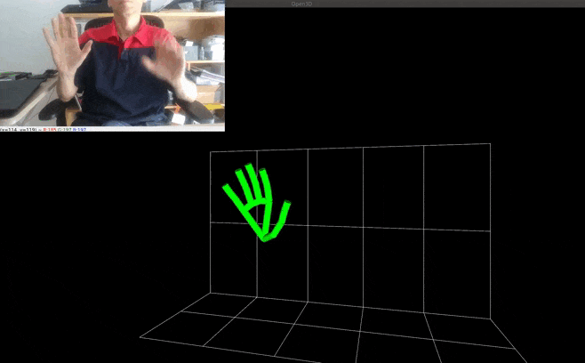](examples/3d_visualization)|
|[Remote control with hand poses](examples/remote_control) |[](examples/remote_control)|

## Credits
* [Google Mediapipe](https://github.com/google/mediapipe)
* Katsuya Hyodo a.k.a [Pinto](https://github.com/PINTO0309), the Wizard of Model Conversion !