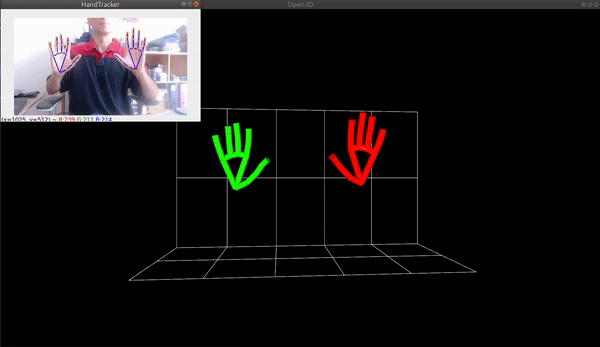
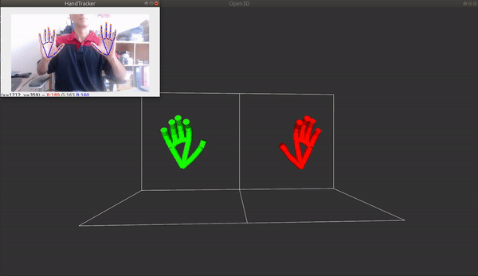
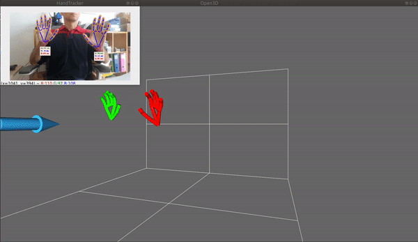

# 3D visualization and smoothing filter

<p align="center"></p>

This demo demonstrates the use of Open3d to visualize hands in pseudo-3D.
Here, pseudo-3D means that 3D information is inferred by the landmark model from 2D images. This information describe the landmark positions relative to a local reference (the wrist landmark or the hand's approximate center, depending on the model output used). In addition, depth-capable devices like OAK-D or OAK-D lite can complement the local information given by the model with global 3D information, by estimating the "real-world" 3D position of the hand's wrist in the camera coordinate system. 

It may seem redundant but the current versions of the Mediapipe landmark models have 2 different outputs that both yields 3D landmarks:
* **21 3D screen landmarks:** each hand is represented as a list of 21 hand landmarks and each landmark is composed of x, y and z. x and y are normalized to [0.0, 1.0] by the image width and height respectively. z represents the landmark depth with the depth at the wrist being the origin, and the smaller the value the closer the landmark is to the camera. The magnitude of z uses roughly the same scale as x. In the *HandRegion* class, these normalized landmarks are stored in the *norm_landmarks* attribute. They are also unnormalized and converted into image pixel locations, stored in the *landmarks* attribute. The mode **image** of this demo uses *landmarks* and *norm_landmarks* to draw the hands in 3D.
* **21 3D metric scale world:** each hand is represented as a list of 21 hand landmarks in world coordinates. Each landmark is composed of x, y and z: estimated real-world 3D coordinates in meters with the origin at the hand’s approximate geometric center. These landmarks are stored in the *world_landmarks* attribute and used in the modes **raw_world** and **world** to draw the hands in 3D. 
In **raw_world** mode, the *world_landmarks* are directly drawn whereas in **world** mode, the rotation corresponding to the bounding rotated rectangle around the hand is first applied to the landmarks (see the difference in the gif images below).

  The fourth demo mode **mixed** (only for depth capable devices) also uses *world_landmarks*, rotated like in **world** mode, but in addition, combined with the hand wrist location measured by the depth sensor. From all mode, **mixed** mode is the closest approximation of the ground truth 3D scene.

|Mode||
|:-:|:-:|
|**image**<br>The wrist landmarks can move but are constrained inside a fixed vertical plane. If a hand seems closer than the other one, it is just because the former is drawn bigger. The hand size is proportional to the hand size in the source image.||
|**raw_world**<br>Here the left hand and right hand are drawn at fixed positions and with roughly constant sizes, whatever the movement of the hands in the image. Note that the wrist landmarks are always pointing down. ||
|**world**<br>The same as **raw_world** mode but with the rotation of the hands in the image applied to the drawn skeleton.||
|**mixed**<br>*For depth-capable device only.*<br>The same as **world** mode but with the hands drawn at the wrist locations measured by the depth sensor. The blue arrow is located at the camera coordinate system origin.||


By default, filtering is applied to the landmarks to reduce jittering.

The color depends on the handedness (green for right hand, red for left hand and in between when uncertain).

Tested on Ubuntu with NVidia GPU (without GPU, open3d runs very slowly).


## Install
To install Open3d:
```
pip install open3d
```

## Usage

```
-> ./demo.py -h
usage: demo.py [-h] [-i INPUT] [--pd_model PD_MODEL] [--lm_model LM_MODEL]
               [-s] [-f INTERNAL_FPS]
               [--internal_frame_height INTERNAL_FRAME_HEIGHT]
               [--single_hand_tolerance_thresh SINGLE_HAND_TOLERANCE_THRESH]
               [-m [{image,world,raw_world,mixed}]] [--no_smoothing]

optional arguments:
  -h, --help            show this help message and exit

Tracker arguments:
  -i INPUT, --input INPUT
                        Path to video or image file to use as input (if not
                        specified, use OAK color camera)
  --pd_model PD_MODEL   Path to a blob file for palm detection model
  --lm_model LM_MODEL   Path to a blob file for landmark model
  -s, --solo            Detect one hand max
  -f INTERNAL_FPS, --internal_fps INTERNAL_FPS
                        Fps of internal color camera. Too high value lower NN
                        fps (default= depends on the model)
  --internal_frame_height INTERNAL_FRAME_HEIGHT
                        Internal color camera frame height in pixels
  --single_hand_tolerance_thresh SINGLE_HAND_TOLERANCE_THRESH
                        (Duo mode only) Number of frames after only one hand
                        is detected before calling palm detection (default=0)

3D Renderer arguments:
  -m [{image,world,raw_world,mixed}], --mode_3d [{image,world,raw_world,mixed}]
                        Specify the 3D coordinates used. See README for
                        description (default=image)
  --no_smoothing        Disable smoothing filter (smoothing works only in solo
                        mode)
```


|Keypress|Function|
|-|-|
|**In OpenCV window:**|
|*Esc* or q|Exit|
|*space*|Pause|
|s|Pause/unpause smoothing filter (if enabled at start)|
|**In Open3d window:**|
|Keypress|Function|
|-|-|
|o|Oscillating (rotating back and forth) of the view|
|r|Continuous rotating of the view|
|s|Stop oscillating or rotating|
|*Up*|Increasing rotating or oscillating speed|
|*Down*|Decreasing rotating or oscillating speed|
|*Right* or *Left*|Change the point of view to a predefined position|
|*Mouse*|Freely change the point of view|