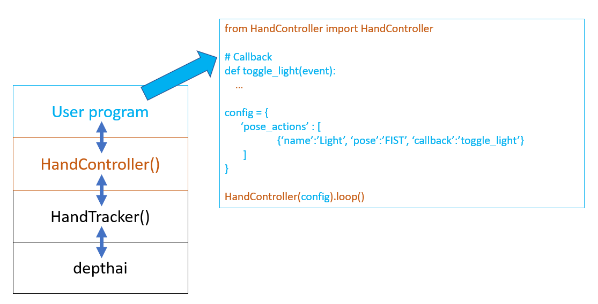
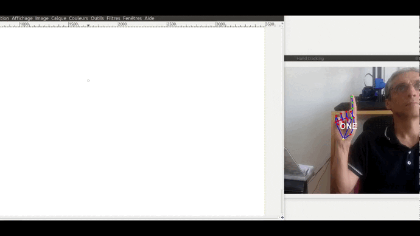

# Remote control with hand poses

The class **HandTracker**, which is the root class of this repository, is suited to detect hands in a video and optionaly, to identify hand poses among a set of poses (ONE, TWO, THREE, FOUR, FIVE, FIST, OK, PEACE).

The class **HandController**, defined in this directory, relies on HandTracker, and let the user easily build programs that triggers actions when selected poses are recognized. **It works only in Solo mode.**

**HandController** is based on an event loop : 
- the user defines in the 'config' dictionary a list of pose-actions. A pose-action associates a pose (eg the FIVE pose with the right hand) and a callback (function that is called when the pose is recognized). The pose-action also describes when and how often the callback is run (once when the pose begins, once the pose ends, periodically every n seconds, continuously for each frame),
- the user provides the callbacks code.

<p float="middle">
  
  
</p>

## 1) API
In order to use HandController, you need to know :
- the structure of the dictionnary **config** where you define what you want to do,
- the structure of the **event** element that is passed as a parameter to the callback.

### The config dictionary

An example of user config:
```
config = {
    'renderer' : {'enable': True},
    
    'pose_actions' : [

        {'name': 'MOVE', 'pose':['ONE','TWO'], 'callback': 'move', "trigger":"continuous", "first_trigger_delay":0.1,},
        {'name': 'CLICK', 'pose':'TWO', 'callback': 'press_release', "trigger":"enter_leave", "first_trigger_delay":0.1},
    ]
}
```

It is important to note that the user config is merged with a default config defined in HandController.py:
```
DEFAULT_CONFIG = {
    'pose_params': 
    {
        "callback": "_DEFAULT_",
        "hand": "any",
        "trigger": "enter", 
        "first_trigger_delay": 0.3, 
        "next_trigger_delay": 0.3, 
        "max_missing_frames": 3,
    },

    'tracker': 
    { 
        'version': 'edge',

        'args': 
        {
            'pd_score_thresh': 0.6,
            'pd_nms_thresh': 0.3,
            'lm_score_thresh': 0.5, 
            'solo': True,
            'internal_fps': 30,
            'internal_frame_height': 640,
            'use_gesture': True
        },
    },

    'renderer':
    {   
        'enable': False,

        'args':
        {
            'output': None,
        }

    }
}
```
The user config supersedes the default config. So for instance, in the example above: `'renderer': {'enable': True}` will be used.

Let's detail the elements of the 'config' dictionary, key by key :
* **tracker**: used to defines the **HandTracker()** instance. Its value is itself a dictionary:
  * **version**: specifies the mode of HandTracker : "host" (postprocessing on the host) or "edge" (postprocessing in a scripting node of the pipeline).
  * **args**: its value is a dictionary containing the arguments of the HandTracker instance. Useful to change the internal camera FPS (`'args': {'internal_fps': 25}`) or to use a video file instead of the internal camera (`'args': {'input_src': 'in_video.mp4'}`) .

* **renderer**: used to defines the **HandRenderer()** instance in case you want to display the visual output of the tracker (optional, mainly used in demos). Its value is itself a dictionary:
  * **enable**: True or False to use the renderer or not.
  * **args**: its value is a dictionary containing the arguments of the HandRenderer instance. Useful if you want to record the visual output of the tracker in a file (`'args': {'output': 'out_video.mp4'}`).

* **pose_params**: its value is a dictionary that sets default values to some pose-action parameters (see below).

* **pose_actions**: its value is a list of pose-action elements. A pose-action element is a dictionary that associates a pose with a calback and sets how and when the callback is triggered. Let's detail a pose-action dictionary, key by key:
  * **name**: a user defined string that identifies the pose-action. Can be useful to distinguish between several pose-actions when they share the same callback.
  * **pose**: a pose or a list of poses or the special keyword "ALL", where a pose is a string from the list ['ONE','TWO','THREE','FOUR','FIVE','OK','PEACE','FIST']. When the value is a list, it means "either pose from the list" (logical OR). 'ALL' is a shortcut for the whole predefined list (so it is equivalent to any pose).
  * **hand**: handedness. Either "left", "right" or "any".
  * **callback**: a string that is the name of a user's function. This function must take one argument. On an event tirggering, the function will be called with a class Event element as the argument.
  * **trigger**: one of the keyword 'enter', 'enter_leave', 'periodic', 'continuous'. Describes when and how often the callback will be called:
    - **enter** (default): an event is triggered once, when the pose begins,
    - **enter_leave**: two events are triggered, one when the pose begins and one when the pose ends,
    - **periodic**: events are triggered periodically as long as the pose stands. The period is given by the parameter **next_trigger_delay** in s.
    - **continuous**: events are triggered on every frame.
  * **first_trigger_delay**: float. Because false positives happen in pose recognition, you don't necessarily want to trigger an event on the first frame where the pose is recognized. The 'first_trigger_delay' in seconds specifies how long the pose has to stand before triggering the corresponding event.
  * **next_trigger_delay**: float. Delay in seconds between 2 consecutive events when **trigger** = **periodic**.
  * **max_missing_frames**: integer. Because the model is not perfect, false negatives happen. Let's take the example where the hand is doing the 'ONE' pose during 20 frames, but the model does not recognize the 'ONE' pose in a few frames among the 20 frames. If the number of missed frames is small, you may want to consider that the serie is uninterrupted (in particular if **trigger** = **enter_leave**). **max_missing_frames** is the number max of missed frames below which the serie is uninterrupted.

### The class Event

The parameter that is passed as a parameter of a callback is an element of the class Event.
Its attributes are:
* **name**: corresponds to the pose-action's **name**.
* **pose**: recognized pose from the list ['ONE','TWO','THREE','FOUR','FIVE','OK','PEACE','FIST']
* **handedness**: handedness of the pose ("left" or "right").
* **callback**: same as pose-action's **callback**.
* **trigger**: same as pose-action's **trigger**.
* **time**: triggering's time = `datetime.datetime.now()`
* **hand**: the HandRegion element generated by the HandTracker that triggered the event. For instance, the example 01_keyboard_tetris.py uses `hand.rotation` to determine the direction of the move and the example 02_mouse.py knows the index finger tip location from `hand.landmarks[8]`.


## 2) Examples

### 00_demo.py - A basic demo

This demo demonstrates the use of the **trigger** parameter and other related parameters.
how the user can control *how* and *when* events are triggered.
It simply prints to the console event information each time an event is triggered. 

The following parameters of a pose-action are used:
- **trigger** : possible values: 
    - **enter** (default): an event is triggered once, when the pose begins,
    - **enter_leave** : two events are triggered, one when the pose begins and one the pose ends,
    - **periodic** : events are triggered periodically as long as the pose stands.
                 The period is given by the parameter **next_trigger_delay** in s.
    - **continuous** : events are triggered on every frame.

- **first_trigger_delay**: because false positive happen in pose recognition, 
you don't necessarily want to trigger an event on the first frame where the pose is recognized.
The 'first_trigger_delay' in seconds specifies how long the pose has to stand before triggering
the corresponding event.

### 01_keyboard_tetris.py - Emulating keystrokes

Sending keystrokes with hand poses to play Tetris.

The game of Tetris is there: https://tetris.com/play-tetris/

The hand poses used to play are:
- FIVE (open hand) to move left or right the falling piece.
The direction of the move is given by the rotation of the hand. 
- ONE to rotate the piece.
- FIST (closed hand) to accelarate the fall.


### 02_mouse.py - Emulating a mouse

Move your mouse pointer with your hand. 
The pointer moves when your hand is doing the ONE or TWO pose.
The difference between ONE and TWO is that in TWO the left button
is also pressed. 

The mouse location is calculated from the index finger tip location.
An double exponential filter is used to limit jittering.



### 03_yeelight.py - Controlling a Yeelight bulb

Switching on/off an IP bulb (brand Yeelight) with the FIST or OK pose
One color preset among 4 can be selected with ONE, TWO, THREE or FOUR pose
The brightness can be changed by rotating an open hand (FIVE)

For this example, the user can stand at a few meters from the camera. Therefore, it helps to enable the Body Pre Focusing mode with the following line in the config :
```
'tracker': {'args': {'body_pre_focusing': 'higher'}},
```

**Prerequisite:**
```
pip install yeelight
```

### 04_sonos.py - Controlling a Sonos player

Play/pause a Sonos player with the FIST or OK pose
Use the ONE pose to query song information (artist, title, album)
The sound volume can be changed by rotating an open hand (FIVE)

For this example, the user can stand at a few meters from the camera. Therefore, it helps to enable the Body Pre Focusing mode with the following line in the config :
```
'tracker': {'args': {'body_pre_focusing': 'higher'}},
```

**Prerequisite:**
```
pip install soco
```